# CKA-Guided Dynamic Sparse Training for Federated Learning under Non-IID MNIST and Fashion-MNIST

## Abstract

This report evaluates a research prototype for simulated federated learning under non-IID label skew. The project compares four methods: dense FedAvg, fixed Sparse FedAvg, FedDST, and CKA-guided FedDST. Experiments are run on MNIST and Fashion-MNIST using five clients, Dirichlet label-skew partitioning with `alpha = 0.3`, a small CNN, five random seeds, and sparsity levels `0.5`, `0.7`, `0.8`, `0.9`, and `0.95`. A second sweep studies CKA-guidance strength values `0.2`, `0.5`, `0.8`, `0.9`, and `1.0`.

The main empirical finding is that dynamic sparse training is substantially more robust than fixed sparse training at high sparsity. On MNIST, Sparse FedAvg collapses to `0.1064 +/- 0.0065` final accuracy at `s = 0.95`, while FedDST reaches `0.7223 +/- 0.0663`. On Fashion-MNIST, Sparse FedAvg collapses to `0.1000 +/- 0.0000`, while FedDST reaches `0.6557 +/- 0.0264`. CKA-guided FedDST is functional and stable, but it does not consistently outperform standard FedDST. Layer-wise CKA values are highly saturated, especially for convolutional layers, which limits the usefulness of CKA as a sparsity-allocation signal in this small-CNN setting.

## Keywords

Federated learning, dynamic sparse training, FedAvg, FedDST, CKA, non-IID data, MNIST, Fashion-MNIST, sparsity, representation similarity.

## 1. Introduction

Federated learning trains a shared model across decentralized clients without centralizing client data. A common challenge is non-IID data: different clients may observe different label distributions, causing client drift and unstable aggregation. At the same time, federated learning is communication-sensitive, motivating sparse models that reduce the number of transmitted active parameters.

This project investigates whether dynamic sparse training can improve sparse federated learning under non-IID data. It also studies a proposed CKA-guided variant, where representation similarity between client models is used to adapt layer-wise sparsity targets. The motivating hypothesis is:

> If a layer has high representational agreement across clients, it may encode shared information and should be preserved with lower sparsity. If a layer has lower agreement, it may be more client-specific and can tolerate higher sparsity.

The experiments compare:

1. **FedAvg**: dense federated averaging baseline.
2. **Sparse FedAvg**: fixed unstructured sparse baseline.
3. **FedDST**: dynamic sparse training with magnitude pruning and gradient-based regrowth.
4. **CKA-FedDST**: FedDST with CKA-guided layer-wise sparsity targets.

The report combines the existing MNIST and Fashion-MNIST result suites and uses only the saved averaged CSV files and generated plots already present in the repository.

## 2. Experimental Setup

### 2.1 Datasets

Two image classification datasets are used:

- **MNIST**: grayscale handwritten digit classification with 10 classes.
- **Fashion-MNIST**: grayscale clothing image classification with 10 classes.

Both datasets use `1 x 28 x 28` inputs and the same model architecture. Fashion-MNIST is visually harder than MNIST and is included to test whether the conclusions hold beyond digit recognition.

### 2.2 Federated Non-IID Partitioning

Each experiment uses:

| Setting | Value |
|---|---:|
| Number of clients | 5 |
| Non-IID split | Dirichlet label skew |
| Dirichlet alpha | 0.3 |
| Local epochs | 1 |
| Communication rounds | 20 |
| Batch size | 64 |
| Learning rate | 0.01 |
| Seeds | 7, 13, 21, 42, 100 |
| Shared CKA reference size | 200 |

The Dirichlet parameter `alpha = 0.3` creates a moderately strong label-skew setting. Lower alpha values produce more uneven label distributions across clients, while higher values approach IID splits.

### 2.3 Model Architecture

All methods use the same `SmallCNN`:

| Layer | Description |
|---|---|
| `conv1` | 2D convolution, 1 input channel, 32 output channels, kernel size 3, padding 1 |
| `conv2` | 2D convolution, 32 input channels, 64 output channels, kernel size 3, padding 1 |
| `fc1` | Fully connected layer from `64 x 7 x 7` to 128 |
| `fc2` | Fully connected classifier from 128 to 10 |

CKA is computed on activations from `conv1`, `conv2`, and `fc1`. The final classifier layer `fc2` is not directly assigned a CKA score because it is more class-decision-specific than representation-forming.

### 2.4 Sparse Training Methods

**Sparse FedAvg** applies a fixed binary mask to trainable weight tensors. Bias parameters are not sparsified. Masks are applied after initialization, local optimizer steps, and aggregation.

**FedDST** maintains fixed total sparsity while periodically updating masks. Active weights with small magnitude are pruned, and inactive weights with large gradient magnitude are regrown. In these experiments:

| Setting | Value |
|---|---:|
| Sparsity initialization | random |
| Mask update interval | 2 rounds |
| Prune fraction | 0.2 |
| Regrowth method | gradient |

**CKA-FedDST** extends FedDST by computing client representation similarity every `cka_interval = 2` rounds. Higher-CKA layers receive lower sparsity targets, while lower-CKA layers receive higher sparsity targets. The total sparsity budget remains approximately controlled.

## 3. Experiment Suites and Result Provenance

The report uses the following averaged result directories:

| Dataset | Suite | Averaged result directory | Runs |
|---|---|---|---:|
| MNIST | Multi-seed baseline | `results/averaged/multiseed/all_20260516_024344` | 80 |
| MNIST | CKA-strength sweep | `results/averaged/cka_strength_sweep/all_20260516_024344` | 125 |
| Fashion-MNIST | Multi-seed baseline | `results/averaged/multiseed/fashion_mnist_all_20260517_180855` | 80 |
| Fashion-MNIST | CKA-strength sweep | `results/averaged/cka_strength_sweep/fashion_mnist_all_20260517_180855` | 125 |

The multi-seed baseline contains `5 seeds x 16 runs = 80` runs per dataset. The CKA-strength sweep contains `5 seeds x 5 strengths x 5 sparsities = 125` CKA-FedDST runs per dataset. In total, this report summarizes 410 completed runs across both datasets.

Metrics are reported as mean +/- standard deviation across seeds.

## 4. Results: MNIST

### 4.1 Final and Best Accuracy

| Method | Sparsity | Final accuracy | Best accuracy |
|---|---:|---:|---:|
| FedAvg | dense | 0.9415 +/- 0.0167 | 0.9433 +/- 0.0146 |
| Sparse FedAvg | 0.5 | 0.9087 +/- 0.0224 | 0.9116 +/- 0.0198 |
| Sparse FedAvg | 0.7 | 0.8838 +/- 0.0234 | 0.8864 +/- 0.0205 |
| Sparse FedAvg | 0.8 | 0.8647 +/- 0.0254 | 0.8666 +/- 0.0226 |
| Sparse FedAvg | 0.9 | 0.5358 +/- 0.2008 | 0.5379 +/- 0.1971 |
| Sparse FedAvg | 0.95 | 0.1064 +/- 0.0065 | 0.1064 +/- 0.0065 |
| FedDST | 0.5 | 0.9124 +/- 0.0201 | 0.9140 +/- 0.0186 |
| FedDST | 0.7 | 0.8959 +/- 0.0233 | 0.9015 +/- 0.0171 |
| FedDST | 0.8 | 0.8857 +/- 0.0194 | 0.8882 +/- 0.0163 |
| FedDST | 0.9 | 0.8610 +/- 0.0266 | 0.8659 +/- 0.0216 |
| FedDST | 0.95 | 0.7223 +/- 0.0663 | 0.7272 +/- 0.0682 |
| CKA-FedDST | 0.5 | 0.9130 +/- 0.0197 | 0.9142 +/- 0.0186 |
| CKA-FedDST | 0.7 | 0.8968 +/- 0.0241 | 0.9032 +/- 0.0168 |
| CKA-FedDST | 0.8 | 0.8828 +/- 0.0214 | 0.8878 +/- 0.0158 |
| CKA-FedDST | 0.9 | 0.8570 +/- 0.0271 | 0.8630 +/- 0.0215 |
| CKA-FedDST | 0.95 | 0.6908 +/- 0.1547 | 0.7040 +/- 0.1565 |

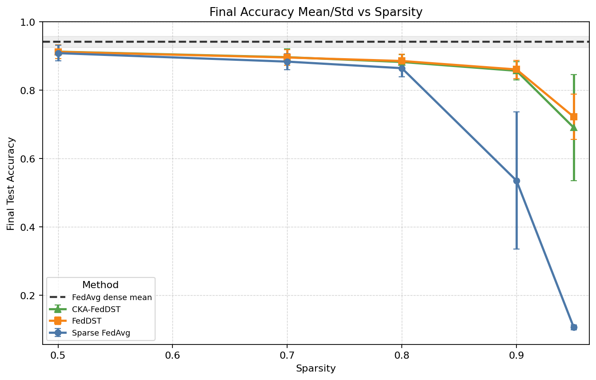

**Figure 1. MNIST final accuracy vs sparsity.** Dynamic sparse methods remain much stronger than fixed Sparse FedAvg at high sparsity. Dense FedAvg remains the upper baseline.

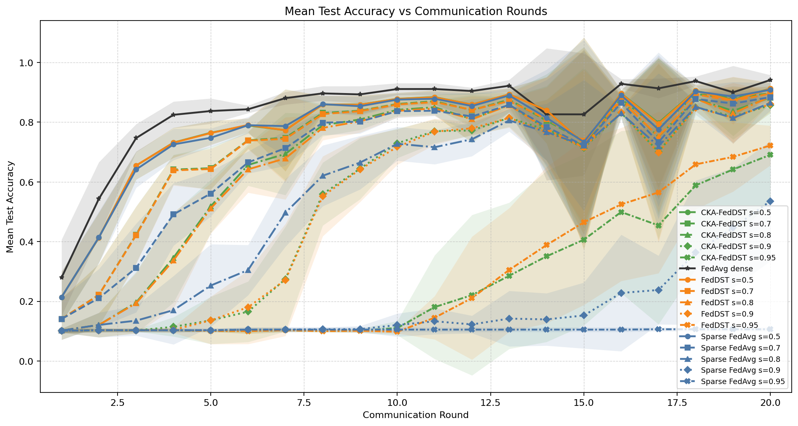

**Figure 2. MNIST accuracy vs communication rounds.** FedDST and CKA-FedDST recover much better than fixed Sparse FedAvg at `s = 0.9` and `s = 0.95`.

### 4.2 MNIST Interpretation

On MNIST, dense FedAvg achieves the best overall accuracy. Sparse FedAvg remains reasonable up to `s = 0.8`, but performance drops sharply at `s = 0.9` and collapses near random guessing at `s = 0.95`.

FedDST provides a large improvement over fixed Sparse FedAvg at high sparsity:

- At `s = 0.9`, FedDST improves final accuracy from `0.5358` to `0.8610`.
- At `s = 0.95`, FedDST improves final accuracy from `0.1064` to `0.7223`.

CKA-FedDST tracks FedDST closely but does not consistently improve it. It is slightly better at `s = 0.5` and `s = 0.7`, but worse at `s = 0.8`, `s = 0.9`, and especially `s = 0.95`.

## 5. Results: Fashion-MNIST

### 5.1 Final and Best Accuracy

| Method | Sparsity | Final accuracy | Best accuracy |
|---|---:|---:|---:|
| FedAvg | dense | 0.7795 +/- 0.0172 | 0.7831 +/- 0.0160 |
| Sparse FedAvg | 0.5 | 0.7398 +/- 0.0151 | 0.7417 +/- 0.0178 |
| Sparse FedAvg | 0.7 | 0.7194 +/- 0.0226 | 0.7223 +/- 0.0215 |
| Sparse FedAvg | 0.8 | 0.7008 +/- 0.0270 | 0.7034 +/- 0.0264 |
| Sparse FedAvg | 0.9 | 0.6057 +/- 0.0650 | 0.6057 +/- 0.0650 |
| Sparse FedAvg | 0.95 | 0.1000 +/- 0.0000 | 0.1000 +/- 0.0000 |
| FedDST | 0.5 | 0.7369 +/- 0.0107 | 0.7399 +/- 0.0145 |
| FedDST | 0.7 | 0.7226 +/- 0.0230 | 0.7281 +/- 0.0223 |
| FedDST | 0.8 | 0.7125 +/- 0.0177 | 0.7198 +/- 0.0223 |
| FedDST | 0.9 | 0.7038 +/- 0.0285 | 0.7067 +/- 0.0250 |
| FedDST | 0.95 | 0.6557 +/- 0.0264 | 0.6561 +/- 0.0271 |
| CKA-FedDST | 0.5 | 0.7376 +/- 0.0093 | 0.7405 +/- 0.0138 |
| CKA-FedDST | 0.7 | 0.7239 +/- 0.0230 | 0.7282 +/- 0.0238 |
| CKA-FedDST | 0.8 | 0.7121 +/- 0.0173 | 0.7214 +/- 0.0205 |
| CKA-FedDST | 0.9 | 0.7085 +/- 0.0240 | 0.7101 +/- 0.0224 |
| CKA-FedDST | 0.95 | 0.6407 +/- 0.0470 | 0.6412 +/- 0.0466 |

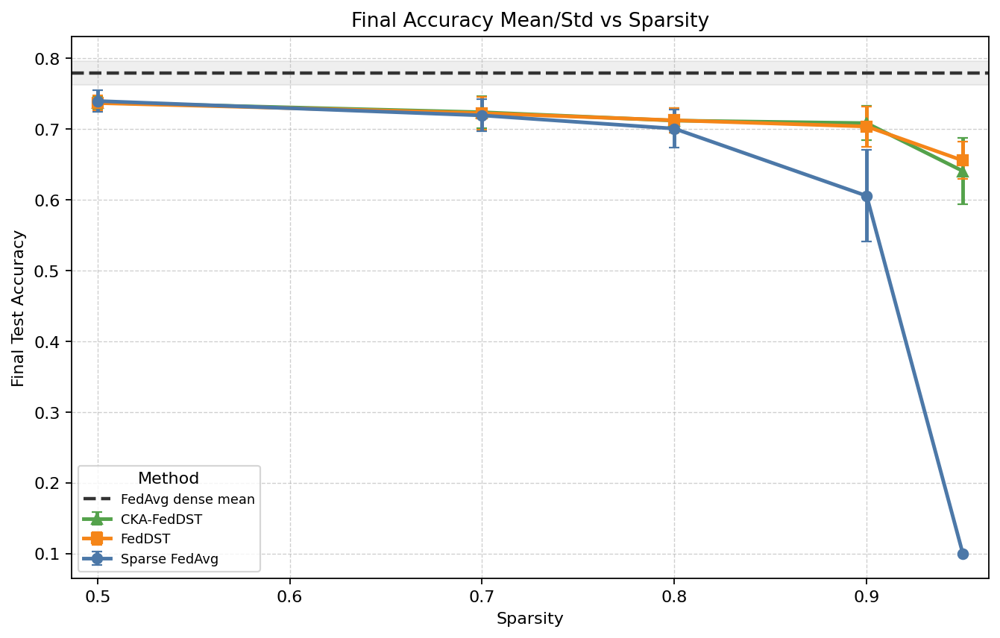

**Figure 3. Fashion-MNIST final accuracy vs sparsity.** Fashion-MNIST is harder than MNIST, but the same high-sparsity pattern appears: dynamic sparse training survives where fixed Sparse FedAvg fails.

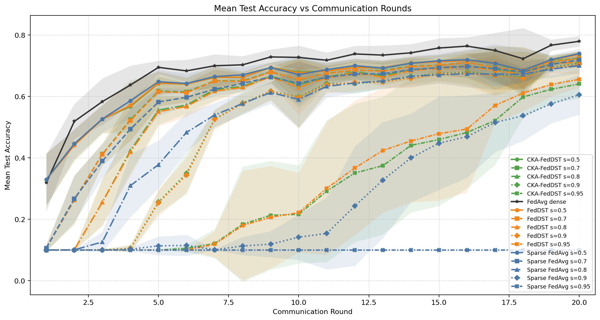

**Figure 4. Fashion-MNIST accuracy vs communication rounds.** At very high sparsity, FedDST and CKA-FedDST learn more slowly but recover by later rounds, while Sparse FedAvg at `s = 0.95` remains at random-guessing accuracy.

### 5.2 Fashion-MNIST Interpretation

Fashion-MNIST lowers accuracy across all methods, as expected. Dense FedAvg reaches `0.7795 +/- 0.0172`, around 16 percentage points below MNIST.

The most important Fashion-MNIST result is the robustness of dynamic sparse training:

- At `s = 0.9`, FedDST improves over Sparse FedAvg by about `+0.0981` final accuracy.
- At `s = 0.95`, FedDST improves over Sparse FedAvg by about `+0.5557` final accuracy.

CKA-FedDST is again close to FedDST. It slightly improves over FedDST at `s = 0.5`, `s = 0.7`, and `s = 0.9`, is nearly tied at `s = 0.8`, and is worse at `s = 0.95`.

## 6. Cross-Dataset Comparison

### 6.1 Generalization of Trends

The same broad pattern appears on both datasets:

1. Dense FedAvg is the strongest overall method.
2. Fixed Sparse FedAvg becomes unstable at high sparsity.
3. FedDST is the strongest sparse baseline.
4. CKA-FedDST is stable but not consistently better than FedDST.

Fashion-MNIST is more difficult, but it strengthens the evidence that dynamic sparse training is useful under high sparsity. At `s = 0.95`, fixed sparse training collapses on both datasets, while dynamic sparse training continues to learn.

### 6.2 Final Accuracy Drop from MNIST to Fashion-MNIST

| Method | Sparsity | MNIST final | Fashion final | Difference |
|---|---:|---:|---:|---:|
| FedAvg | dense | 0.9415 | 0.7795 | -0.1620 |
| Sparse FedAvg | 0.8 | 0.8647 | 0.7008 | -0.1639 |
| Sparse FedAvg | 0.9 | 0.5358 | 0.6057 | +0.0699 |
| Sparse FedAvg | 0.95 | 0.1064 | 0.1000 | -0.0064 |
| FedDST | 0.8 | 0.8857 | 0.7125 | -0.1732 |
| FedDST | 0.9 | 0.8610 | 0.7038 | -0.1572 |
| FedDST | 0.95 | 0.7223 | 0.6557 | -0.0666 |
| CKA-FedDST | 0.8 | 0.8828 | 0.7121 | -0.1707 |
| CKA-FedDST | 0.9 | 0.8570 | 0.7085 | -0.1485 |
| CKA-FedDST | 0.95 | 0.6908 | 0.6407 | -0.0501 |

The positive value for Sparse FedAvg at `s = 0.9` should not be interpreted as Fashion-MNIST being easier. Sparse FedAvg is highly unstable at this sparsity, with large seed variance on MNIST. The more meaningful pattern is that dynamic sparse methods degrade more gracefully at high sparsity.

## 7. CKA-Strength Sweep

### 7.1 MNIST CKA-Strength Results

| CKA strength | Average final accuracy | Average best accuracy |
|---:|---:|---:|
| 0.2 | 0.8481 | 0.8544 |
| 0.5 | 0.8482 | 0.8545 |
| 0.8 | 0.8484 | 0.8551 |
| 0.9 | 0.8491 | 0.8553 |
| 1.0 | 0.8496 | 0.8556 |

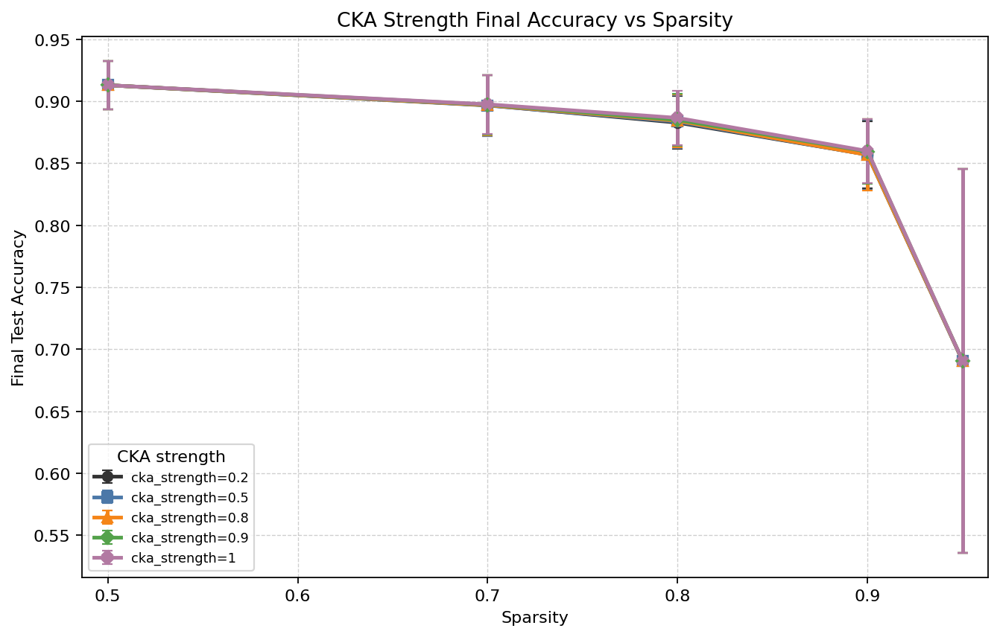

**Figure 5. MNIST CKA-strength final accuracy vs sparsity.** Increasing CKA strength gives only small changes. The strongest value, `1.0`, is slightly better on average, but the effect size is small.

### 7.2 Fashion-MNIST CKA-Strength Results

| CKA strength | Average final accuracy | Average best accuracy |
|---:|---:|---:|
| 0.2 | 0.7046 | 0.7083 |
| 0.5 | 0.7046 | 0.7081 |
| 0.8 | 0.7050 | 0.7084 |
| 0.9 | 0.7053 | 0.7087 |
| 1.0 | 0.7052 | 0.7087 |

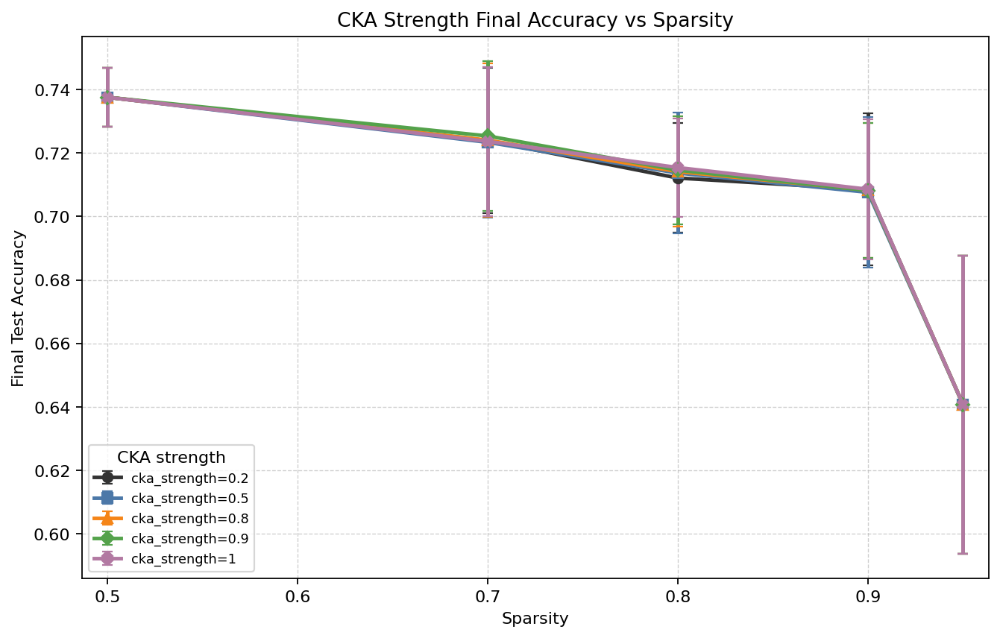

**Figure 6. Fashion-MNIST CKA-strength final accuracy vs sparsity.** CKA-strength curves are almost overlapping, indicating that the guidance strength has little practical effect in this setting.

### 7.3 Interpretation of CKA Strength

The CKA-strength sweep does not produce a strong result. On both datasets, increasing `cka_strength` from `0.2` to `1.0` changes average accuracy only marginally. This suggests that the current CKA signal is too weak or too saturated to substantially alter the mask dynamics.

## 8. Layer-Wise CKA and Sparsity Behavior

### 8.1 Final Layer-Wise CKA at Default Strength

The following table reports final average pairwise CKA values for CKA-FedDST with `cka_strength = 0.2`.

| Dataset | Sparsity | conv1 CKA | conv2 CKA | fc1 CKA |
|---|---:|---:|---:|---:|
| MNIST | 0.5 | 1.0000 | 1.0000 | 0.9774 |
| MNIST | 0.7 | 1.0000 | 1.0000 | 0.9749 |
| MNIST | 0.8 | 1.0000 | 1.0000 | 0.9710 |
| MNIST | 0.9 | 1.0000 | 1.0000 | 0.9732 |
| MNIST | 0.95 | 1.0000 | 1.0000 | 0.9654 |
| Fashion-MNIST | 0.5 | 1.0000 | 1.0000 | 0.9855 |
| Fashion-MNIST | 0.7 | 1.0000 | 1.0000 | 0.9850 |
| Fashion-MNIST | 0.8 | 1.0000 | 1.0000 | 0.9822 |
| Fashion-MNIST | 0.9 | 1.0000 | 1.0000 | 0.9819 |
| Fashion-MNIST | 0.95 | 1.0000 | 1.0000 | 0.9871 |

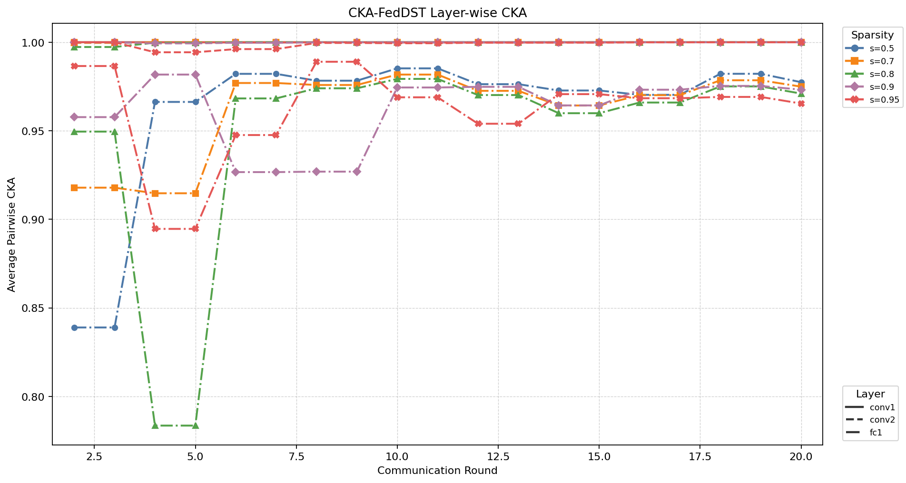

**Figure 7. MNIST CKA-FedDST layer-wise CKA.** Convolutional layers are nearly saturated at CKA close to 1.0. The `fc1` layer has slightly lower but still high CKA.

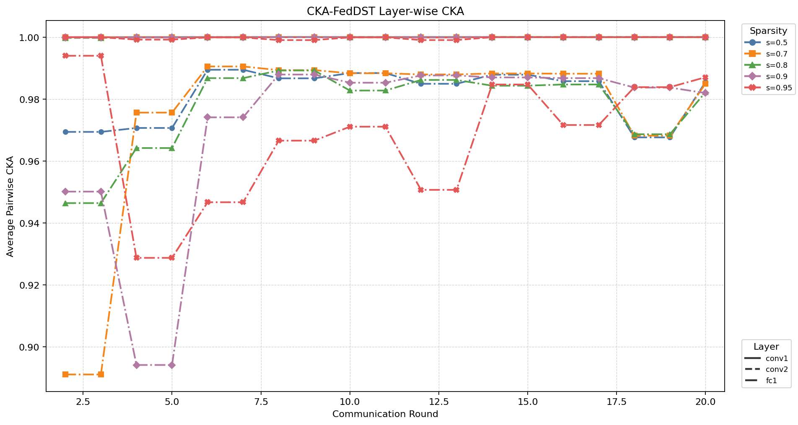

**Figure 8. Fashion-MNIST CKA-FedDST layer-wise CKA.** Fashion-MNIST also shows strong CKA saturation, including very high `fc1` similarity.

### 8.2 Sparsity Control

The sparse methods maintain their intended total sparsity. Final active parameter counts are effectively identical across MNIST and Fashion-MNIST because both use the same model architecture.

| Target sparsity | Active parameters |
|---:|---:|
| 0.5 | about 210,704 |
| 0.7 | about 126,422 |
| 0.8 | about 84,282 |
| 0.9 | about 42,141 |
| 0.95 | about 21,070 |

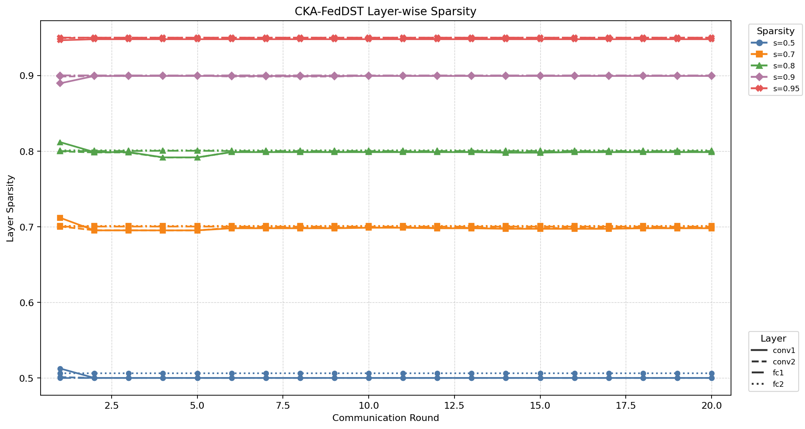

**Figure 9. MNIST CKA-FedDST layer-wise sparsity.** The overall sparsity budget is preserved. Layer-wise deviations are small.

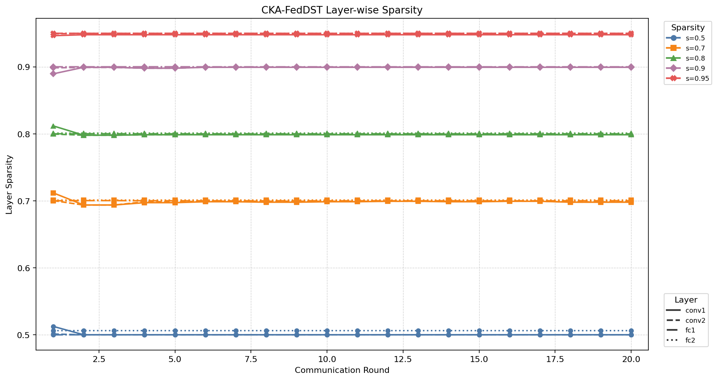

**Figure 10. Fashion-MNIST CKA-FedDST layer-wise sparsity.** Fashion-MNIST similarly shows stable sparsity control across rounds and sparsity levels.

## 9. Discussion

### 9.1 What Is Strongly Supported

The strongest finding is that dynamic sparse training is much better than fixed sparse training at high sparsity under non-IID federated learning. FedDST prevents the high-sparsity collapse observed in Sparse FedAvg on both datasets.

This is especially clear at `s = 0.95`:

| Dataset | Sparse FedAvg | FedDST | FedDST improvement |
|---|---:|---:|---:|
| MNIST | 0.1064 | 0.7223 | +0.6159 |
| Fashion-MNIST | 0.1000 | 0.6557 | +0.5557 |

This supports the use of pruning and gradient-based regrowth in sparse federated learning.

### 9.2 What Is Not Yet Strongly Supported

The proposed CKA-guided FedDST method is implemented and behaves sensibly, but the results do not show a consistent advantage over FedDST. CKA-FedDST is sometimes slightly better, sometimes slightly worse.

For example:

| Dataset | Sparsity | CKA-FedDST minus FedDST |
|---|---:|---:|
| MNIST | 0.7 | +0.0009 |
| MNIST | 0.9 | -0.0040 |
| MNIST | 0.95 | -0.0315 |
| Fashion-MNIST | 0.7 | +0.0013 |
| Fashion-MNIST | 0.9 | +0.0047 |
| Fashion-MNIST | 0.95 | -0.0150 |

These differences are small relative to seed variance, especially at high sparsity.

### 9.3 Why CKA Guidance May Be Weak Here

The most likely reason is CKA saturation. The CKA scores for `conv1` and `conv2` are almost always near `1.0`, while `fc1` is also very high. If all measured layers have similar CKA, then the guidance mechanism has little contrast to decide which layers should receive more or fewer active weights.

The current model is also small. A compact CNN on MNIST-like grayscale datasets may learn similar early and mid-level representations across clients even under label skew. A deeper architecture or more complex dataset may create more meaningful layer-wise representation differences.

## 10. Limitations

1. **No statistical significance testing.** The report uses mean and standard deviation across five seeds, but does not run formal tests.
2. **Only two datasets.** MNIST and Fashion-MNIST are useful prototypes, but they are still relatively small grayscale datasets.
3. **Small model architecture.** The SmallCNN may not provide enough depth for CKA-guided layer allocation to become meaningful.
4. **Single non-IID setting.** Experiments use only `alpha = 0.3`; different alpha values may change the conclusions.
5. **Communication cost is approximated.** Active parameter count is a useful proxy, but not a full byte-level communication analysis.
6. **CKA reference set is small.** The shared reference loader uses 200 examples, which is efficient but may limit CKA stability.
7. **CKA layers exclude classifier output.** This is intentional, but it also means the classifier layer is not directly guided by CKA.

## 11. Conclusion

The experiments support one clear result: dynamic sparse training is a strong sparse federated learning baseline under non-IID data. FedDST substantially outperforms fixed Sparse FedAvg at high sparsity on both MNIST and Fashion-MNIST.

The proposed CKA-guided FedDST method is correctly integrated and preserves the sparsity budget, but it does not yet demonstrate a reliable performance advantage over FedDST. The CKA signal appears too saturated in the current small-CNN setting, leaving little useful layer-wise contrast for adaptive sparsity allocation.

The most scientifically accurate conclusion is therefore:

> CKA-guided FedDST is a promising and functional research prototype, but on MNIST and Fashion-MNIST with a small CNN, the CKA-guidance signal is not sufficiently discriminative to consistently improve over standard FedDST.

The next research step should be to evaluate the method on a deeper model and a harder dataset, such as CIFAR-10 with a small ResNet, where layer-wise representational differences may be more informative.

## 12. Reproducibility Notes

The experiments summarized here are traceable to averaged CSV outputs under:

- `results/averaged/multiseed/all_20260516_024344`
- `results/averaged/cka_strength_sweep/all_20260516_024344`
- `results/averaged/multiseed/fashion_mnist_all_20260517_180855`
- `results/averaged/cka_strength_sweep/fashion_mnist_all_20260517_180855`

The main plots are stored under:

- `results/plots/multiseed/all_20260516_024344`
- `results/plots/cka_strength_sweep/all_20260516_024344`
- `results/plots/multiseed/fashion_mnist_all_20260517_180855`
- `results/plots/cka_strength_sweep/fashion_mnist_all_20260517_180855`

The reported values are from aggregated mean/std CSV files rather than manually selected individual runs.

## Appendix A. Additional Plots

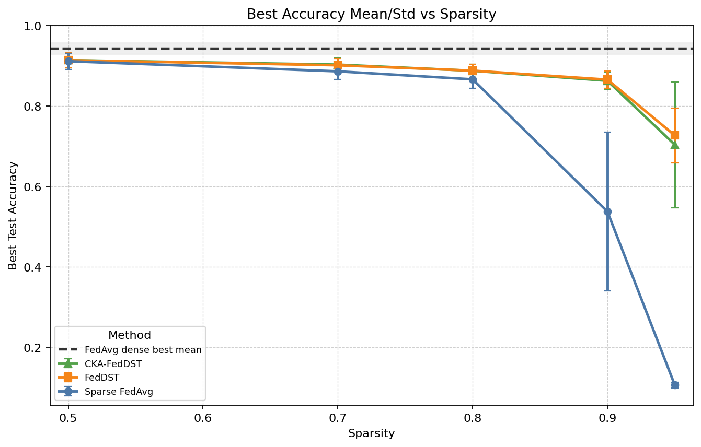

**Figure A1. MNIST best accuracy vs sparsity.**

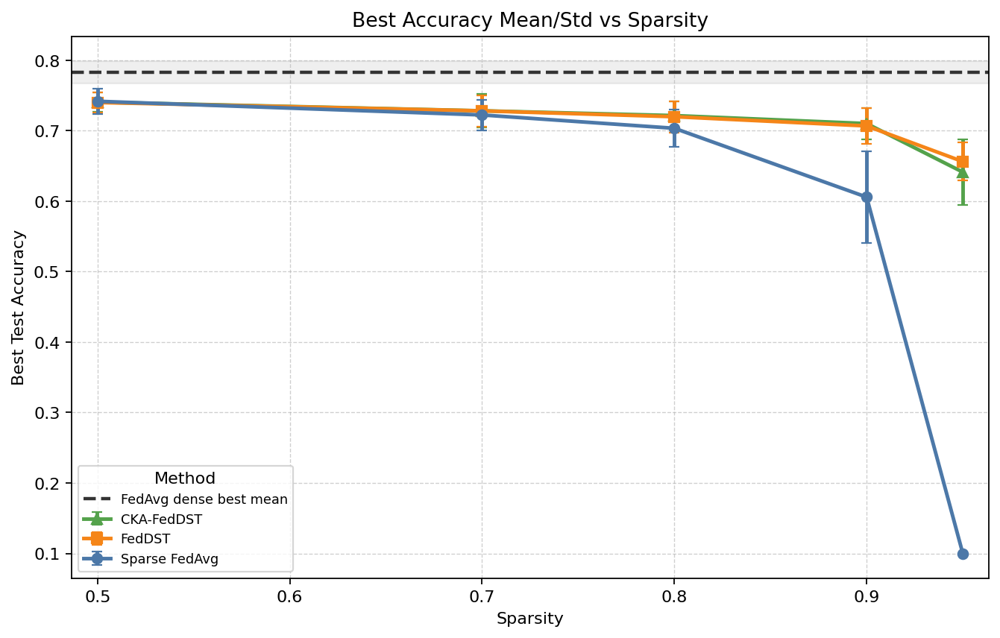

**Figure A2. Fashion-MNIST best accuracy vs sparsity.**

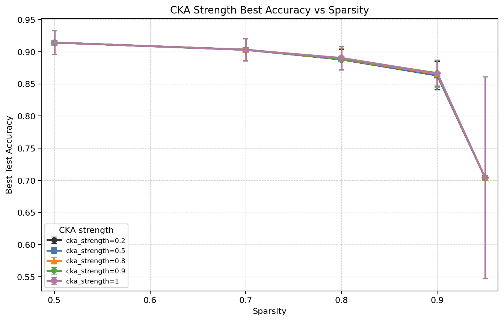

**Figure A3. MNIST CKA-strength best accuracy vs sparsity.**

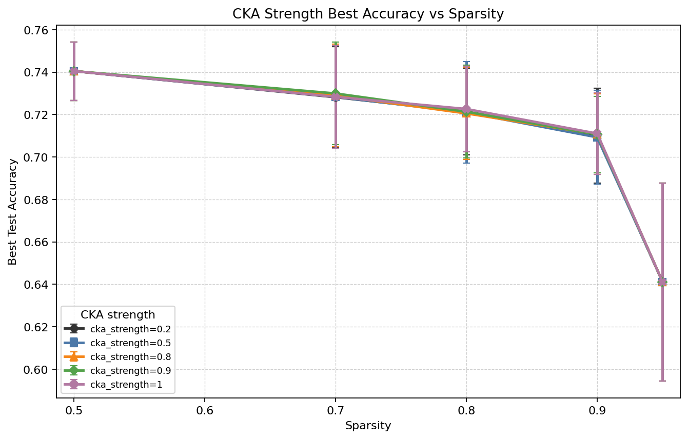

**Figure A4. Fashion-MNIST CKA-strength best accuracy vs sparsity.**

